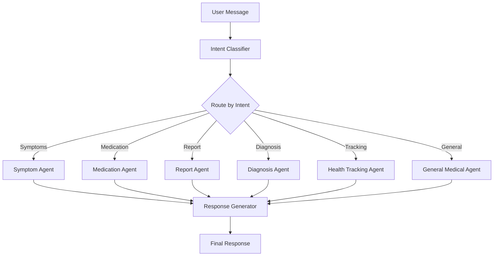

# Medical AI Agent

An advanced medical AI assistant built with LangGraph, featuring 8 specialized agents, free medical APIs, and intelligent report analysis.


## Features

### Core Capabilities
- **8 Specialized AI Agents**: Symptom analysis, medication management, diagnosis assistance, report analysis, and more
- **Medical Report Analysis**: Upload PDFs/images and get AI-powered analysis with FREE OCR
- **Medication Safety**: Drug interaction checking with RxNorm API
- **Differential Diagnosis**: Advanced medical reasoning with PubMed integration
- **Health Tracking**: Track vitals, symptoms, medications, and conditions
- **Memory System**: Short-term (conversation) and long-term (ChromaDB) memory
- **Medical-Only Responses**: Automatically rejects non-medical queries

### Free Medical APIs Integrated
All APIs are completely FREE - no paid subscriptions required!

1. **OpenFDA** - Drug information and adverse events
2. **RxNorm** - Drug interactions and safety
3. **PubMed** - Medical literature and research
4. **ICD-10** - Medical condition codes
5. **OCR.space** - Text extraction from reports (25,000 requests/month free)

## Tech Stack

### Backend
- **Python 3.11+** with FastAPI
- **LangGraph** for multi-agent orchestration
- **LangChain** for LLM integration
- **OpenAI GPT-4** for medical AI reasoning
- **SQLAlchemy** + SQLite for data persistence
- **ChromaDB** for vector storage and memory
- **Pydantic v2** for data validation

### Frontend
- **React 18** with Vite
- **TailwindCSS** for styling
- **Zustand** for state management
- **Axios** for API calls
- **React Router** for navigation

## Installation

### Prerequisites
- Python 3.11 or higher
- Node.js 18+ and npm
- OpenAI API key ([Get one here](https://platform.openai.com/api-keys))

### 1. Clone the Repository
```bash
git clone https://github.com/yourusername/medicalagent.git
cd medicalagent
```

### 2. Backend Setup
```bash
cd backend

# Create virtual environment
python -m venv venv

# Activate virtual environment
# On Mac/Linux:
source venv/bin/activate
# On Windows:
venv\Scripts\activate

# Install dependencies
pip install -r requirements.txt

# Create .env file
cp .env.example .env

# Edit .env and add your OpenAI API key
# OPENAI_API_KEY=sk-your-key-here

# Run backend
python -m uvicorn app.main:app --reload --host 0.0.0.0 --port 8000
```

Backend will be running at: http://localhost:8000

### 3. Frontend Setup
Open a new terminal:
```bash
cd frontend

# Install dependencies
npm install

# Run frontend
npm run dev
```

Frontend will be running at: http://localhost:5173

### 4. Access the Application
1. Open browser to http://localhost:5173
2. Login with demo account:
   - Email: `demo@medical.ai`
   - Password: `demo123`

## Usage

### Chat with the Medical AI
```
User: "I have a headache and fever for 2 days"
AI: Provides symptom analysis, possible causes, and recommendations
```

### Upload Medical Reports
1. Click the 📎 paperclip icon in chat
2. Select PDF/JPG/PNG file (max 10MB)
3. Type "analyze" or "what does this report say?"
4. AI extracts text and provides detailed analysis

### Check Drug Interactions
```
User: "I'm taking aspirin and ibuprofen, are they safe together?"
AI: Uses RxNorm API to check interactions and provide safety information
```

### Track Health Data
```
User: "My blood pressure is 120/80 mmHg"
AI: Logs the data and provides interpretation
```

## Project Structure

```
medicalagent/
├── backend/
│   ├── app/
│   │   ├── agents/              # LangGraph agents
│   │   │   └── orchestrator.py  # Main agent orchestrator
│   │   ├── api/                 # FastAPI endpoints
│   │   │   ├── auth.py
│   │   │   ├── chat.py
│   │   │   └── upload.py
│   │   ├── core/                # Core configurations
│   │   ├── models/              # SQLAlchemy models
│   │   ├── schemas/             # Pydantic schemas
│   │   └── services/            # Business logic
│   │       ├── external_apis.py # Free medical APIs
│   │       ├── file_processor.py # OCR & report analysis
│   │       └── memory_service.py # Memory management
│   ├── requirements.txt
│   └── .env.example
├── frontend/
│   ├── src/
│   │   ├── components/          # React components
│   │   ├── pages/               # Page components
│   │   ├── lib/                 # Utilities
│   │   └── store/               # Zustand stores
│   ├── package.json
│   └── vite.config.js
├── .gitignore
└── README.md
```

## LangGraph Architecture

The system uses 8 specialized agents orchestrated by LangGraph:

1. **Intent Classifier** - Classifies user intent
2. **General Medical Agent** - Handles general queries
3. **Symptom Agent** - Analyzes symptoms
4. **Medication Agent** - Provides medication information and safety checks
5. **Report Agent** - Analyzes uploaded medical reports
6. **Diagnosis Agent** - Assists with differential diagnosis
7. **Health Tracking Agent** - Logs and tracks health data
8. **Response Generator** - Formats final responses



## API Endpoints

### Authentication
- `POST /auth/register` - Register new user
- `POST /auth/login` - Login and get JWT token

### Chat
- `POST /chat/message` - Send message to AI
- `GET /chat/conversations` - Get all conversations
- `GET /chat/conversations/{id}` - Get conversation details

### Upload
- `POST /upload/report` - Upload medical report
- `GET /upload/reports` - Get all user reports
- `GET /upload/reports/{id}/analysis` - Get report analysis

### Dashboard
- `GET /dashboard/stats` - Get user health statistics

## Free Medical APIs - No Setup Required

All medical APIs used are **completely FREE** and require **no API keys**:

### 1. OpenFDA
- **Purpose**: Drug information, adverse events
- **Free tier**: Unlimited
- **Docs**: https://open.fda.gov/apis/

### 2. RxNorm
- **Purpose**: Drug interactions, medication information
- **Free tier**: Unlimited
- **Docs**: https://rxnav.nlm.nih.gov/

### 3. PubMed
- **Purpose**: Medical literature search
- **Free tier**: Unlimited
- **Docs**: https://www.ncbi.nlm.nih.gov/home/develop/api/

### 4. ICD-10
- **Purpose**: Medical condition codes
- **Free tier**: Unlimited
- **Docs**: https://clinicaltables.nlm.nih.gov/

### 5. OCR.space
- **Purpose**: Text extraction from images/PDFs
- **Free tier**: 25,000 requests/month
- **Docs**: https://ocr.space/ocrapi

## Environment Variables

### Backend (.env)
```bash
# Required
OPENAI_API_KEY=sk-your-key-here

# Optional (defaults provided)
DATABASE_URL=sqlite:///./medical_agent.db
SECRET_KEY=your-secret-key
CORS_ORIGINS=http://localhost:5173
```

## Testing

### Test Free APIs
```bash
cd backend
source venv/bin/activate
python test_free_apis.py
```

### Manual Testing
See [COMPLETE_SETUP_GUIDE.md](COMPLETE_SETUP_GUIDE.md) for comprehensive testing instructions.

## Security

- JWT-based authentication
- Password hashing with bcrypt
- CORS protection
- SQL injection prevention with SQLAlchemy
- Input validation with Pydantic
- Medical-only query filtering

## Limitations

- **Educational/Research Use Only** - Not a substitute for professional medical advice
- **AI Limitations** - May make mistakes, always verify with healthcare professionals
- **OpenAI API Required** - Needs paid OpenAI API key (GPT-4)
- **OCR Accuracy** - Free OCR may not be 100% accurate for all reports

## Troubleshooting

### Backend won't start
- Check Python version: `python --version` (must be 3.11+)
- Ensure virtual environment is activated
- Verify OpenAI API key in `.env`

### Frontend won't start
- Check Node version: `node --version` (must be 18+)
- Delete `node_modules` and run `npm install` again
- Check if port 5173 is available

### Database errors
- Delete `medical_agent.db` and restart backend (fresh database)
- Check file permissions in backend directory

### API errors
- Verify OpenAI API key is valid
- Check API rate limits
- Ensure backend is running and accessible

## Contributing

1. Fork the repository
2. Create feature branch (`git checkout -b feature/AmazingFeature`)
3. Commit changes (`git commit -m 'Add AmazingFeature'`)
4. Push to branch (`git push origin feature/AmazingFeature`)
5. Open Pull Request

## License

This project is licensed under the MIT License - see LICENSE file for details.

## Acknowledgments

- OpenAI for GPT-4 API
- LangChain/LangGraph for agent framework
- OpenFDA, RxNorm, PubMed for free medical APIs
- OCR.space for free OCR service

## Support

For issues and questions:
- Open an issue on GitHub
- Check [COMPLETE_SETUP_GUIDE.md](COMPLETE_SETUP_GUIDE.md) for detailed documentation

## Disclaimer

This is an educational project. The AI agent is NOT a replacement for professional medical advice, diagnosis, or treatment. Always seek the advice of qualified health providers with any questions you may have regarding medical conditions.

---

Built with ❤️ using LangGraph, FastAPI, and React
